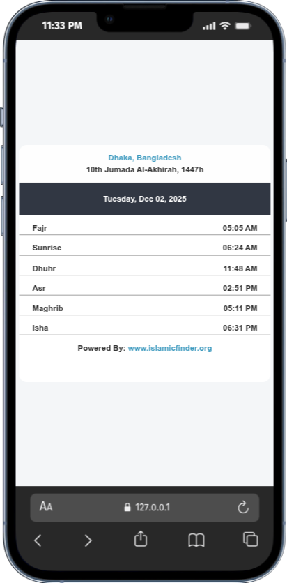

# Islamic Prayer Times Widget

A clean, modern, and SEO-optimized webpage that displays live Islamic prayer times using the official IslamicFinder widget.  
The widget is perfectly centered both vertically and horizontally and works on all screen sizes.

## 📸 Project Output

The final rendered output looks like this:

*(This screenshot displays the IslamicFinder prayer widget showing today's prayer times for Dhaka, Bangladesh.)*

## 📜 License

This project is free for personal and commercial use.  
The IslamicFinder widget belongs to **IslamicFinder.org**.

## 🙏 Credits

Prayer times are powered by:  
**IslamicFinder.org – Prayer Widget API**